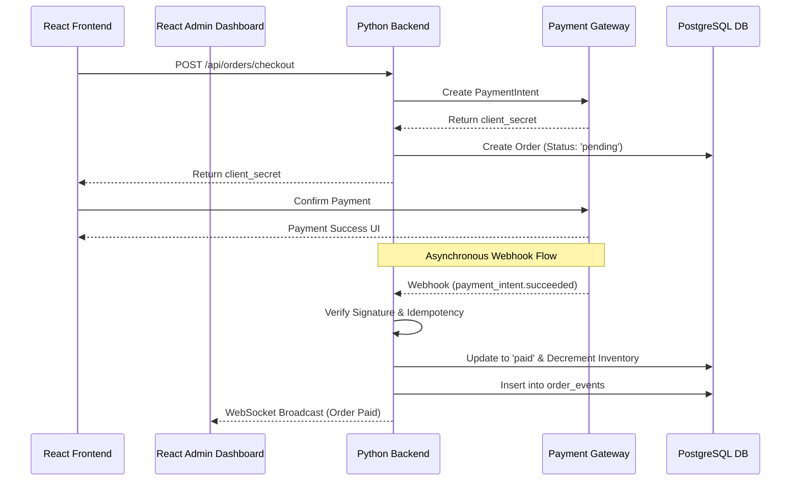
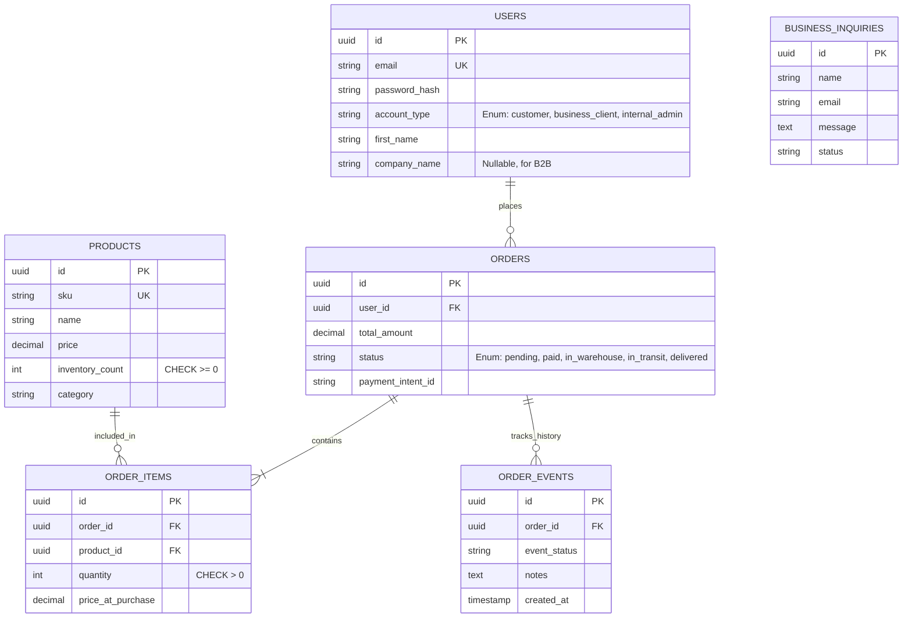

# Squad Gear: Master Product Requirements & Architecture Document

## 1. Executive Summary
**Squad Gear** is a comprehensive e-commerce platform specializing in streetwear (shirts, trousers, etc.). The platform caters to individual retail customers (B2C), business clients (B2B), and features a robust real-time administrative dashboard for internal order fulfillment.

### Technology Stack
- **Frontend**: React (with Context API / Redux for state management)
- **Backend**: Python (FastAPI or Django)
- **Database**: PostgreSQL
- **Payments**: Third-party gateway (e.g., Stripe)
- **Real-Time Layer**: WebSockets

---

## 2. Frontend Architecture (React)
The frontend serves three primary user personas: Standard Customers, Business Clients, and Internal Admins.

### Core Page Structure
1. **Home / Landing Page**: Showcasing featured streetwear and promotions.
2. **Product Catalog**: Browsing, filtering, and searching the inventory.
3. **Checkout Flow**: Cart management, shipping details, and secure payment tokenization.
4. **About / B2B Section**: Information on wholesale purchasing and a contact form for business inquiries.
5. **Customer/Business Portal**: Order history and profile management.
6. **Internal Admin Dashboard**: A secure portal for business admins to monitor order fulfillment in real-time.

### Real-Time Admin Dashboard
The admin dashboard establishes a secure **WebSocket** connection with the backend. It listens for fulfillment events (`order_placed`, `payment_received`, `sent_to_warehouse`) and updates the UI instantly without requiring page refreshes.

---

## 3. Backend Architecture (Python)
**Architecture Pattern**: Modular Monolith with Event-Driven Real-Time Components

### Service Decomposition
1. **User & Auth Service**: Handles JWT authentication and Role-Based Access Control (Roles: `customer`, `business_client`, `internal_admin`).
2. **Product Catalog Service**: Manages inventory and provides fast, indexed searches.
3. **Order Management Service**: Validates carts and calculates totals securely on the server-side.
4. **Admin & Fulfillment Service**: Handles the WebSocket broadcasting to keep the frontend admin dashboard updated.
5. **Business Inquiry Service**: Processes contact form submissions from the "About" section.

---

## 4. Payment Processing Architecture
Payments are handled securely via a Payment Gateway to ensure sensitive card data never touches the Squad Gear servers.

### The Payment Lifecycle
1. **Initialization**: React requests checkout; Python backend creates a `PaymentIntent` and returns a secure `client_secret`.
2. **Confirmation**: React securely confirms the payment directly with the Payment Gateway.
3. **Webhook Fulfillment (Critical Path)**:
   - The Payment Gateway asynchronously posts a webhook to the Python backend confirming success.
   - The backend verifies the cryptographic signature of the webhook.
   - The backend uses a database lock (`SELECT ... FOR UPDATE`) to prevent race conditions.
   - The backend updates the order to `paid`, decrements inventory, and inserts a log into `order_events`.
   - The backend broadcasts a WebSocket message to the **React Admin Dashboard** that the order is ready for the warehouse.

---

## 5. Database Architecture & ERD (PostgreSQL)
The database enforces strict ACID compliance. The `ORDER_EVENTS` table serves as an append-only audit log, powering the real-time fulfillment history.

### Security & Reliability Guardrails
- **Idempotency**: Webhooks are checked against existing orders to prevent double-processing.
- **Constraints**: PostgreSQL `CHECK` constraints prevent negative inventory.
- **Transactions**: All order placements and inventory adjustments are wrapped in DB transactions.
